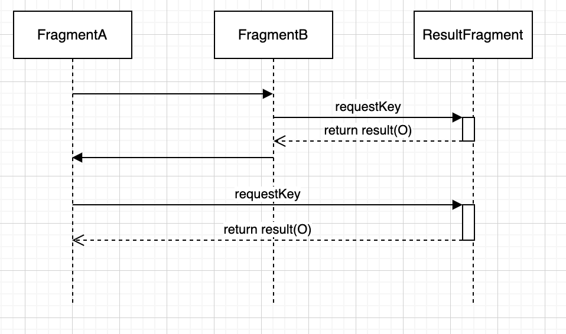

# fragment result api에서 중복된 requestKey 관리

setFragmentResultListener을 호출하는 시점에 따라 fragment result 수신 여부를 테스트 합니다.

## 클래스 설명

실선은 화면 전환을, 점선은 fragment result 전달을 나타냅니다.

**ResultFragment:**

Fragment result를 등록하고 popbackstack을 수행합니다.

**FragmentA:**

ResultFragment, FragmentB로 화면 전환을 시도하거나 등록된 Fragment result를 보여줍니다.

**FragmentB:**

등록된 Fragment result를 보여줍니다.

## 화면 전환 시나리오

세로선은 시간이며 가로선은 fragment 전환을 나타냅니다.

FragmentA -> FragmentB -> ResultFragment -> FragmentB -> FragmentA -> ResultFragment -> FragmentA

순서로 이동하면서 ResultFragment로부터 fragment result를 제대로 받아오는지 테스트합니다.

## 테스트

테스트를 하면서 FragmentA, FragmentB의 setFragmentResultCallback() 호출 시점을 수정해주세요.

각 Frament 클래스의 setFragmentResultCallback() 주석을 수정해주시면됩니다.

### onCreate에서 호출하는 경우

fragment onCreate callback에서 FragmentResultListener를 등록하는 방법입니다.

[공식 홈페이지 가이드](https://developer.android.com/guide/fragments/communicate#pass-between-fragments)
에서 제공하는 방법으로 수행합니다.

setFragmentResultListener()이 호출되면 기존에 등록된 requestKey로 fragmentResultListener가 덮어씌워지기 때문에 새로운 결과를 받을
수 없습니다.

### onViewCreated에서 호출하는 경우

fragment onViewCreated callback에서 FragmentResultListener를 등록하는 방법입니다.

가장 마지막에 생성된 fragmentView로 fragmentResultListener가 덮어씌워지기 때문에 새로운 결과를 받을 수 있습니다.

## 테스트 결과 고찰

왜 이런 차이가 발생할까요?

Fragment Result api는 아래의 특징을 갖고 있습니다.

1) fragmentResultListener는 키-값 쌍으로 등록됩니다. 동일한 키로 등록을 시도하면 이전의 listener는 제거됩니다.

2) fragmentResultListener는 한번 결과를 전달하면 해제됩니다.

3) 만약 전달될 리스너가 없이 result가 등록되는 경우 동일한 키로 fragmentResultListener가 등록되길 기다립니다.

이는 다른 모듈에서 다룰 내용이지만 addToBackStack과도 연관됩니다.

addToBackStack으로 fragment 전환이 발생하면 fragmentView는 해제되지만 fragment는 남아있습니다.

popBackStack호출을 통한 FragmentA, FragmentB로의 복귀는 새로운 fragment instance를 생성하지 않고 fragmentView만 재생성합니다.

이 점을 이용하여 onViewCreated에서 FragmentResultListener를 등록하면 3)의 특징을 이용하여 result를 받아올 수 있게됩니다.

## 기타

만약 여러 fragment가 동시에 생성되는 경우에는 어떻게 처리할 수 있을까요?

FragmentResultListener 키를 관리하는 mResultListeners 객체는 fragmentManager마다 생성됩니다.

복잡한 fragment container 구조에선 childFragmentManager을 이용하거나, activity 또는 viewModel 등의 중간자를 이용하여 대응하는 것을
권장합니다.

## 참고 링크

[https://developer.android.com/guide/fragments/communicate#fragment-result](https://developer.android.com/guide/fragments/communicate#fragment-result)